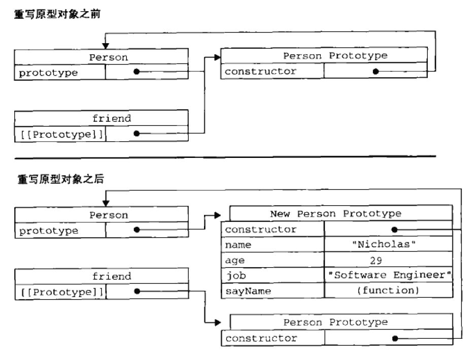

### 原型与 in 操作符

1. 有两种方式使用 in 操作符：单独使用和在 for-in 循环中使用。在单独使用时，in 操作符会在通过对象能够访问给定属性时返回 true，无论该属性存在于实例中还是原型中。hasOwnProperty()只在属性存在于实例中时才返回 true，因此同时使用 hasOwnProperty()方法和 in 操作符，就可以确定该属性到底是存在于对象中，还是存在于原型中。封装方法如下：

```javascript
/**
 *
 * @param {*} object 检测的对象
 * @param {*} name 检测对象的属性
 * return true 表示属性存在于原型中，false 表示属性存在于对象中
 */
function hasPrototypeProperty(object, name) {
  return !Object.hasOwnProperty(name) && name in object;
}
```

2. 要取得对象自身所有**可枚举**的实例属性，可以使用 ECMAScript5 的 Object.keys()方法。这个方法接收一个对象作为参数，返回一个包含所有可枚举属性的字符串数组。

```javascript
function Person() {}
Person.prototype.name = "ming";
Person.prototype.age = 22;
Person.prototype.job = "code";
Person.prototype.getName = function () {
  return this.name;
};

var keys = Object.keys(Person.prototype);
console.log(keys); // [ 'name', 'age', 'job', 'getName' ]

var p1 = new Person();
p1.name = "hong";
p1.age = 18;
var p1Keys = Object.keys(p1);
console.log(p1Keys); // [ 'name', 'age' ]
```

这里，变量 keys 是一个数组，数组中是字符串'name', 'age', 'job', 'getName'。这个顺序和 for-in 循环中出现的顺序一致。如果传参是 Person 的实例，则 Object.keys()返回的数组只包含'name'和'age'这两个实例属性。

3. 如果想要得到所有的对象自身属性（不包括 Symbol 值作为名称的属性），无论它是否可枚举，都可以使用 Object.getOwnPropertyNames()方法。

```javascript
var keys = Object.getOwnPropertyNames(Person.prototype);
console.log(keys); // [ 'constructor', 'name', 'age', 'job', 'getName' ]
```

注意结果中包含了不可枚举的 constructor 属性。Object.keys()和 Object.getOwnPropertyNames()方法都可以用来替代 for-in 循环，但需要注意两者之间的区别。

### 原型的动态性

1. 由于在原型中查找值的过程是一次搜索，因此我们对原型对象所做的任何修改都能够立即从实例上反射出来——即使是先创建了实例后修改原型也是照样如此。

```javascript
function Person() {}
var p = new Person();
Person.prototype.sayHi = function () {
  console.log("hi");
};
p.sayHi(); // hi
```

当我们调用 p.sayHi()时，首先会在实例中搜索名为 sayHi 的属性，在没找到的情况下，会继续搜索原型。因为实例与原型之间的连接只不过是一个指针，而非一个副本，因此就可以在原型中找到新的 sayHi 属性并返回函数。

2. 尽管可以随时为原型添加属性和方法，并且修改能够立即在所有对象实例中反映出来，但如果是重写整个原型对象，那么情况就不一样了。我们知道，调用构造函数时会为实例添加一个指向最初原型的[[prototype]]指针，而把原型修改为另外一个对象就等于切断了构造函数与最初原型之间的联系。请记住：实例中的指针仅指向原型，而不指向构造函数。

```javascript
function Person() {}
var friend = new Person();
Person.prototype = {
  constructor: Person,
  name: "ming",
  age: 22,
  job: "code",
  sayName: function () {
    console.log(this.name);
  },
};
friend.sayName(); // TypeError: friend.sayName is not a function
```


从图中可以看出，重写原型对象切断了现有原型与任何之前已经存在的对象实例之间的联系，它们引用的仍然是最初的原型。

### 动态原型模式

有其他 OO 语言经验的开发人员在看到独立的构造函数和原型时，很可能感到非常困惑。动态原型模式正是致力于解决这个问题的一个方案，它把所有信息都封装在了构造函数中，而通过在构造函数中初始化原型（仅在必要的情况下），又保持了同时使用构造函数和原型的优点。换句话说，可以通过检查某个应该存在的方法是否有效，来决定是否需要初始化原型。

```javascript
function Person(name, age, job) {
  this.name = name;
  this.age = age;
  this.job = job;
  if (typeof this.sayName !== "function") {
    Person.prototype.sayName = function () {
      console.log(this.name);
    };
  }
}
var friend = new Person("ming", 22, "software engineer");
friend.sayName();
```

### 寄生构造函数模式

这种模式的基本思想是创建一个函数，该函数的作用仅仅是封装创建对象的代码，然后在返回新创建的对象；但从表面上看，这个函数又很像是典型的构造函数。这个模式可以在特殊的情况下用来为对象创建构造函数。假设我们想创建一个具有额外方法的特殊数组。由于不能直接修改 Array 构造函数，因此可以使用这个模式。

```javascript
function SpecialArray() {
  // 创建数组对象
  var values = new Array();
  // 添加值
  values.push.apply(values, arguments);
  // 添加方法
  values.toPipedString = function () {
    return this.join("|");
  };
  // 返回数组
  return values;
}
var colors = new SpecialArray("red", "blue", "green");
console.log(colors.toPipedString()); // red|blue|green
```

关于寄生构造函数模式，有一点需要说明：返回的对象与构造函数或者与构造函数的原型属性之间没有关系。为此，不能依赖 instanceof 操作符来确定对象类型。由于存在上述问题，我们建议在可以使用其他模式的情况下，不要使用这种模式。
